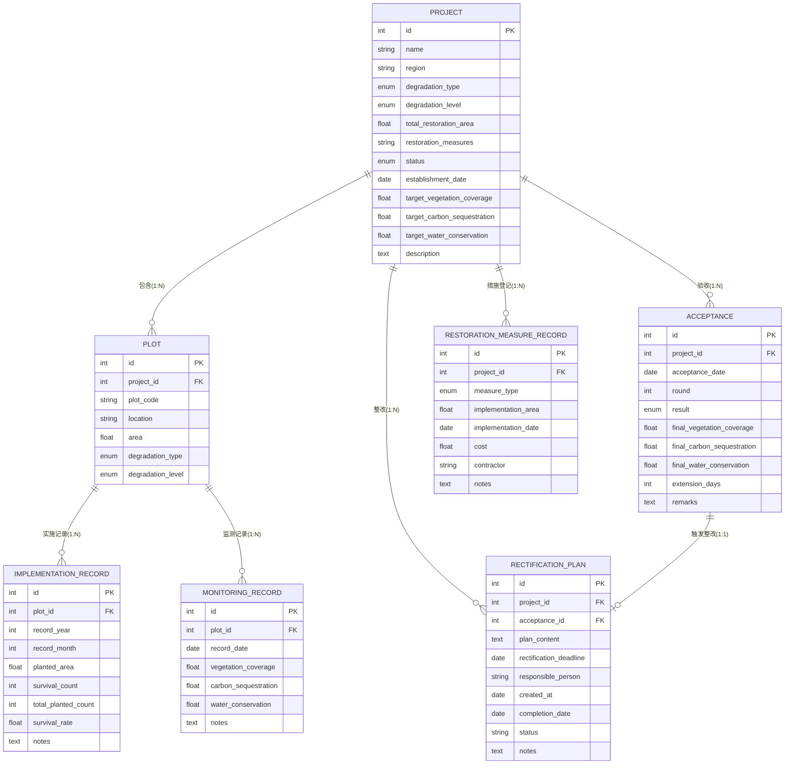

# 青藏高原湿地草地退化修复项目管理系统 — 数据流说明文档

## 一、系统概述

本系统用于管理青藏高原东北缘湿地草地退化修复项目的全生命周期，涵盖项目立项、分地块实施、监测、验收、整改等完整业务流程。系统采用 FastAPI + SQLAlchemy 技术栈，数据持久化存储于 SQLite 数据库。

核心实体包括：**项目（Project）**、**地块（Plot）**、**实施记录（ImplementationRecord）**、**监测记录（MonitoringRecord）**、**验收（Acceptance）**、**整改方案（RectificationPlan）**、**修复措施记录（RestorationMeasureRecord）**。

---

## 二、实体关系图（ER图）



### 实体关系核心要点：

1. **项目与地块**：一对多关系。一个修复项目拆分为多个具体地块分别实施和监测，地块是实施和监测的最小单元。
2. **地块与实施/监测记录**：一对多关系。每个地块有多条按月度的实施记录和按日期的监测记录。
3. **项目与验收**：一对多关系。一个项目可经历多轮验收（第一轮未达标→整改→第二轮验收）。
4. **验收与整改方案**：一对一关系。当验收结果为"需延期整改"时，必须关联一份整改方案。
5. **项目与修复措施**：一对多关系。项目层面登记整体采用的修复措施类型。

---

## 三、数据流转总览图

```mermaid
flowchart TD
    %% 阶段定义
    A[项目立项<br/>ProjectCreate] --> B[划分地块<br/>PlotCreate]
    B --> C[状态流转: 实施中<br/>ProjectStatus=IMPLEMENTING]
    
    %% 实施阶段
    C --> D[按地块录入实施记录<br/>ImplementationRecord]
    D --> E[实施完成<br/>状态流转: 监测期<br/>ProjectStatus=MONITORING]
    
    %% 监测阶段
    E --> F[按地块录入监测记录<br/>MonitoringRecord]
    F --> G[验收预览<br/>/acceptances/preview/{id}]
    
    %% 验收判定
    G --> H{三项指标<br/>全部达标?}
    H -->|是| I[创建验收记录<br/>结果=达标<br/>状态=ACCEPTED]
    H -->|否| J[创建验收记录<br/>结果=需延期整改<br/>状态=RECTIFICATION]
    
    %% 整改支线
    J --> K[登记整改方案<br/>RectificationPlan]
    K --> L[整改期内补充监测数据<br/>MonitoringRecord]
    L --> M[完成整改<br/>状态回到 MONITORING]
    M --> G
    
    %% 统计汇总
    I --> N[按区域/退化类型/措施类型统计<br/>Statistics APIs]
```

---

## 四、分地块组织方式详解

### 4.1 项目与地块的层级结构

**代码定位**：[models.py L75-L88](file:///Users/ding/Documents/SOLOCODE%203/0612/macmini/zj-00265-wetmend-5/models.py#L75-L88)

```
项目（Project）
├── 总修复面积: total_restoration_area = 300.0 亩
├── 立项目标: 植被覆盖度≥90%, 固碳≥100吨, 水源涵养≥600万m³
│
├── 地块1（Plot）: plot_code="GN-SD-001"
│   ├── 位置: 玛曲县采日玛乡
│   ├── 面积: 150.0 亩（占项目50%）
│   ├── 实施记录: 2024-07, 2024-08, ...（按月）
│   └── 监测记录: 2025-03-15, 2025-06-15, ...（按日期）
│
└── 地块2（Plot）: plot_code="GN-SD-002"
    ├── 位置: 玛曲县曼日玛乡
    ├── 面积: 150.0 亩（占项目50%）
    ├── 实施记录: 2024-07, 2024-08, ...
    └── 监测记录: 2025-03-15, 2025-06-15, ...
```

### 4.2 分地块实施记录

**代码定位**：[main.py L168-L180](file:///Users/ding/Documents/SOLOCODE%203/0612/macmini/zj-00265-wetmend-5/main.py#L168-L180)

实施记录与地块绑定，按年月录入，包含：
- `planted_area`：当月补植面积
- `total_planted_count`：总种植株数
- `survival_count`：存活株数
- `survival_rate`：存活率（=存活数/总数×100%）

**业务约束**：只有项目状态为 `IMPLEMENTING`（实施中）时，才能录入实施记录。

### 4.3 分地块监测记录

**代码定位**：[main.py L205-L217](file:///Users/ding/Documents/SOLOCODE%203/0612/macmini/zj-00265-wetmend-5/main.py#L205-L217)

监测记录与地块绑定，按具体日期录入，包含三项核心指标：
- `vegetation_coverage`：植被覆盖度（%）
- `carbon_sequestration`：固碳量（吨）
- `water_conservation`：水源涵养量（万立方米）

**业务约束**：只有项目状态为 `MONITORING`（监测期）或 `RECTIFICATION`（整改期）时，才能录入监测记录。

---

## 五、验收达标比对逻辑详解

### 5.1 项目级最终指标计算

**代码定位**：[main.py L16-L37](file:///Users/ding/Documents/SOLOCODE%203/0612/macmini/zj-00265-wetmend-5/main.py#L16-L37)

这是最核心的数据聚合函数 `_calculate_project_final_indicators`，算法如下：

```python
def _calculate_project_final_indicators(db_project: Project):
    # 1. 遍历项目下所有地块
    for plot in db_project.plots:
        # 2. 取每个地块的【最新】监测记录（按 record_date 取最大值）
        latest = max(plot.monitoring_records, key=lambda r: r.record_date)
        
        # 3. 植被覆盖度：按地块面积加权平均
        #    公式: Σ(地块覆盖度 × 地块面积) / Σ地块面积
        weighted_vegetation += latest.vegetation_coverage * plot.area
        total_area += plot.area
        
        # 4. 固碳量：各地块直接相加（总量指标）
        total_carbon += latest.carbon_sequestration
        
        # 5. 水源涵养量：各地块直接相加（总量指标）
        total_water += latest.water_conservation
    
    # 6. 计算最终结果
    final_vegetation = weighted_vegetation / total_area
    return (final_vegetation, total_carbon, total_water)
```

**关键设计说明**：

| 指标 | 计算方式 | 原因 |
|------|---------|------|
| 植被覆盖度 | **面积加权平均** | 覆盖度是比例指标，大的地块对项目整体覆盖度影响更大 |
| 固碳量 | **直接求和** | 固碳是总量指标，各地块固碳量相加即为项目总固碳 |
| 水源涵养量 | **直接求和** | 同上，总量指标直接相加 |

### 5.2 指标达标判定

**代码定位**：[main.py L40-L67](file:///Users/ding/Documents/SOLOCODE%203/0612/macmini/zj-00265-wetmend-5/main.py#L40-L67)

函数 `_build_comparisons` 构建三项指标的比对结果：

```python
comparisons = [
    {
        "indicator_name": "植被覆盖度(%)",
        "target_value": project.target_vegetation_coverage,  # e.g. 90.0
        "actual_value": final_vegetation,                     # e.g. 82.85
        "reached": actual_value >= target_value               # False
    },
    {
        "indicator_name": "固碳量(吨)",
        "target_value": project.target_carbon_sequestration,  # e.g. 100.0
        "actual_value": total_carbon,                         # e.g. 56.3
        "reached": actual_value >= target_value               # False
    },
    {
        "indicator_name": "水源涵养量(万立方米)",
        "target_value": project.target_water_conservation,    # e.g. 600.0
        "actual_value": total_water,                          # e.g. 308.5
        "reached": actual_value >= target_value               # False
    }
]
```

### 5.3 综合验收结论

**代码定位**：[main.py L297-L354](file:///Users/ding/Documents/SOLOCODE%203/0612/macmini/zj-00265-wetmend-5/main.py#L297-L354)

```python
# 三项指标必须全部达标
overall_reached = all(c.reached for c in comparisons)

# 判定结果
result = AcceptanceResult.PASSED if overall_reached else AcceptanceResult.EXTENDED

# 自动状态流转
if result == AcceptanceResult.PASSED:
    project.status = ProjectStatus.ACCEPTED      # 验收通过
else:
    project.status = ProjectStatus.RECTIFICATION  # 进入整改期
```

**验收轮次管理**：通过 `round` 字段记录验收轮次，每次验收前查询该项目已有验收记录数 + 1。

### 5.4 完整示例（甘南玛曲项目整改流程）

参考测试文件：[test_rectification_flow.py](file:///Users/ding/Documents/SOLOCODE%203/0612/macmini/zj-00265-wetmend-5/test_rectification_flow.py)

| 阶段 | 操作 | 数据 | 结果 |
|------|------|------|------|
| 第一轮监测 | 录入监测数据 | 地块5: 覆盖度83.2%, 地块6: 覆盖度82.5% | 加权平均 = (83.2×150 + 82.5×150)/300 = 82.85% |
| 第一轮验收 | 发起验收 | 目标覆盖度90%，实际82.85% | 未达标 → 需延期整改，状态=RECTIFICATION |
| 整改期 | 登记整改方案 + 补充监测 | 地块5: 91.5%, 地块6: 90.8% | 加权平均 = (91.5×150 + 90.8×150)/300 = 91.15% |
| 完成整改 | 调用 /complete 接口 | - | 状态回到 MONITORING |
| 第二轮验收 | 再次发起验收 | 目标90%，实际91.15% | 达标 → 状态=ACCEPTED |

---

## 六、统计汇总逻辑详解

### 6.1 按区域统计（by-region）

**代码定位**：[main.py L486-L518](file:///Users/ding/Documents/SOLOCODE%203/0612/macmini/zj-00265-wetmend-5/main.py#L486-L518)

```python
# 数据聚合层级: 地块监测 → 项目指标 → 区域汇总
for project in projects:
    region = project.region
    
    # 1. 累加项目级基础数据
    region_stats[region]["total_projects"] += 1
    region_stats[region]["total_restoration_area"] += project.total_restoration_area
    
    # 2. 取项目最新验收结果（如有）
    if project.acceptances:
        latest_acceptance = max(project.acceptances, key=lambda a: a.round)
        # 2.1 累加验收时的最终固碳量
        region_stats[region]["total_carbon_sequestration"] += latest_acceptance.final_carbon_sequestration
        # 2.2 判断是否达标（只要有一轮达标就算达标项目）
        if any(a.result == AcceptanceResult.PASSED for a in project.acceptances):
            region_stats[region]["passed_projects"] += 1
    else:
        # 3. 未验收项目，从监测数据动态计算
        indicators = _calculate_project_final_indicators(project)
        if indicators is not None:
            _, actual_carbon, _ = indicators
            region_stats[region]["total_carbon_sequestration"] += actual_carbon
```

**统计字段**：
- `total_projects`：该区域项目总数
- `total_restoration_area`：总修复面积（直接累加项目的 total_restoration_area）
- `total_carbon_sequestration`：总固碳量（已验收用验收值，未验收用监测计算值）
- `passed_projects`：达标项目数（任一轮验收达标即算）

### 6.2 按退化类型统计（by-degradation-type）

**代码定位**：[main.py L521-L553](file:///Users/ding/Documents/SOLOCODE%203/0612/macmini/zj-00265-wetmend-5/main.py#L521-L553)

逻辑与按区域统计完全一致，仅分组维度从 `region` 改为 `degradation_type`（湿地萎缩 / 草地沙化）。

### 6.3 按修复措施成效统计（by-measure-effectiveness）

**代码定位**：[main.py L647-L730](file:///Users/ding/Documents/SOLOCODE%203/0612/macmini/zj-00265-wetmend-5/main.py#L647-L730)

这是最复杂的统计，用于对比不同修复措施的成效：

```python
for project in projects:
    # 1. 获取项目实际指标（优先从监测数据计算，其次从验收记录取）
    indicators = _get_project_actual_indicators(project)
    
    # 2. 判断项目是否达标
    passed = any(a.result == AcceptanceResult.PASSED for a in project.acceptances)
    
    # 3. 遍历项目采用的所有修复措施类型
    for measure_record in project.measure_records:
        measure_type = measure_record.measure_type.value
        
        # 4. 按措施类型分组累加
        measure_stats[measure_type]["project_ids"].add(project.id)
        measure_stats[measure_type]["total_implementation_area"] += measure_record.implementation_area
        
        if has_data:
            # 收集各项目的实际指标，用于计算平均值
            measure_stats[measure_type]["vegetation_coverage_values"].append(actual_veg)
            measure_stats[measure_type]["carbon_sequestration_values"].append(actual_carbon)
            measure_stats[measure_type]["water_conservation_values"].append(actual_water)
            measure_stats[measure_type]["target_reach_rates"].append(reach_rate)
        
        if passed:
            measure_stats[measure_type]["passed_count"] += 1

# 5. 计算各措施类型的统计指标
for measure_type, stats in measure_stats.items():
    total_projects = len(stats["project_ids"])
    avg_veg = avg(stats["vegetation_coverage_values"])
    avg_carbon = avg(stats["carbon_sequestration_values"])
    avg_water = avg(stats["water_conservation_values"])
    avg_reach = avg(stats["target_reach_rates"])
    pass_rate = stats["passed_count"] / total_projects * 100
```

**统计字段**：
- `total_projects`：采用该措施的项目数
- `total_implementation_area`：该措施累计实施面积
- `avg_vegetation_coverage`：采用该措施项目的平均植被覆盖度
- `avg_carbon_sequestration`：平均固碳量
- `avg_water_conservation`：平均水源涵养量
- `avg_target_reach_rate`：平均目标达标率（单项指标达标数/3×100%）
- `total_passed_projects`：达标项目数
- `pass_rate`：达标通过率（%）

### 6.4 数据汇总层级示意

```
监测记录（MonitoringRecord）—— 最细粒度，按地块按日期
    ↓ 取各地块最新记录
地块级最终指标
    ↓ 加权平均 / 求和
项目级最终指标（_calculate_project_final_indicators）
    ↓ 按 region / degradation_type / measure_type 分组
区域/退化类型/措施类型级统计汇总
```

---

## 七、核心代码文件速查表

| 功能模块 | 代码文件 | 关键函数/类 |
|---------|---------|------------|
| 数据模型定义 | [models.py](file:///Users/ding/Documents/SOLOCODE%203/0612/macmini/zj-00265-wetmend-5/models.py) | Project, Plot, ImplementationRecord, MonitoringRecord, Acceptance |
| API接口定义 | [main.py](file:///Users/ding/Documents/SOLOCODE%203/0612/macmini/zj-00265-wetmend-5/main.py) | _calculate_project_final_indicators, _build_comparisons, create_acceptance |
| 数据Schema | [schemas.py](file:///Users/ding/Documents/SOLOCODE%203/0612/macmini/zj-00265-wetmend-5/schemas.py) | AcceptancePreview, IndicatorComparison, StatisticsByRegion |
| 初始化数据 | [init_data.py](file:///Users/ding/Documents/SOLOCODE%203/0612/macmini/zj-00265-wetmend-5/init_data.py) | init_sample_data() |
| 整改流程测试 | [test_rectification_flow.py](file:///Users/ding/Documents/SOLOCODE%203/0612/macmini/zj-00265-wetmend-5/test_rectification_flow.py) | main() |

---

## 八、关键业务约束汇总

1. **实施记录**：仅当项目状态为 `IMPLEMENTING` 时可录入
2. **监测记录**：仅当项目状态为 `MONITORING` 或 `RECTIFICATION` 时可录入
3. **验收前置条件**：
   - 项目状态为 `MONITORING` 或 `RECTIFICATION`
   - 项目下至少有一条监测记录
   - 不存在已达标的验收记录（防止重复验收）
4. **整改方案**：仅能为结果为 `EXTENDED` 的验收记录创建，且一条验收记录只能关联一份整改方案
5. **达标判定**：植被覆盖度、固碳量、水源涵养量三项指标必须**全部**达到或超过立项目标

---

*文档版本: 1.0.0*  
*最后更新: 2026-06-13*
